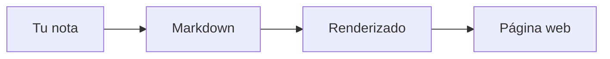
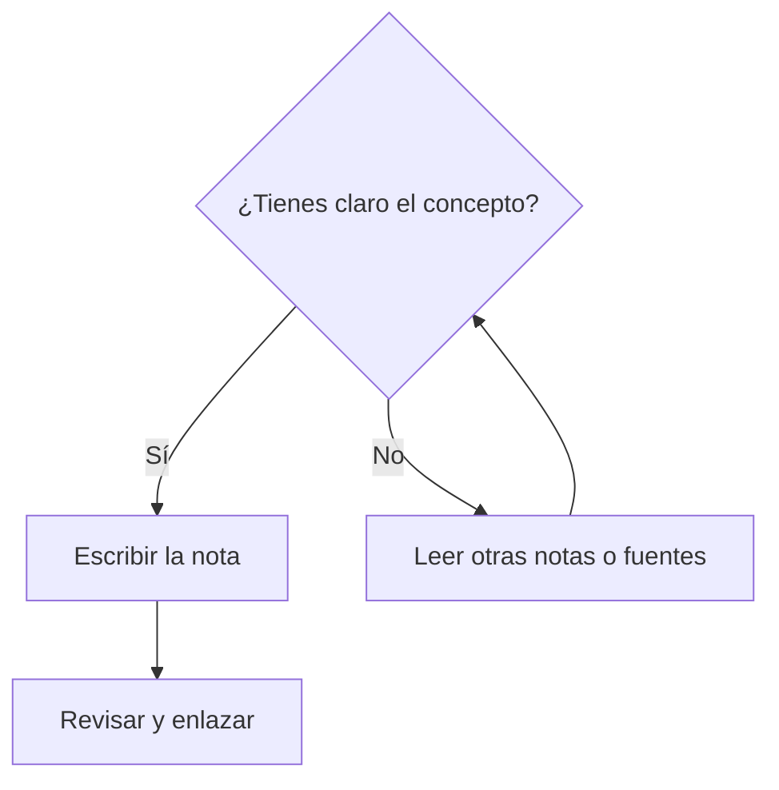

# Ejemplos de uso de la biblioteca

Esta página muestra **ejemplos de todo lo que puedes usar** en los archivos Markdown de la biblioteca: encabezados, listas, código, tablas, enlaces, diagramas Mermaid y bloques de nota o advertencia. Úsala como referencia al escribir o editar notas.

---

## Encabezados y texto

Los encabezados se escriben con `#` (uno para título principal, dos para sección, etc.). El texto admite **negrita**, *cursiva* y `` `código en línea` ``.

- Lista con viñetas: un elemento.
- Otro elemento.
- Y un tercero.

Lista numerada:

1. Primer paso.
2. Segundo paso.
3. Tercero.

---

## Enlaces internos y externos

- Enlace a otra nota de la biblioteca: [Scrum](/docs/marcos-trabajo/scrum), [Fundamentos de bases de datos](/docs/bases-datos/fundamentos).
- Enlace externo: [Documentación de Docusaurus](https://docusaurus.io).

---

## Código

Código en línea: `const x = 1;` o `SELECT * FROM usuarios`.

Bloque de código con resaltado de sintaxis (por ejemplo JavaScript):

```javascript
function saludar(nombre) {
  return `Hola, ${nombre}`;
}
saludar('Biblioteca');
```

Bloque SQL:

```sql
SELECT id, nombre FROM usuarios WHERE activo = true;
```

---

## Tablas

| Concepto     | Descripción                          |
|-------------|--------------------------------------|
| **Markdown**| Lenguaje de marcado ligero.          |
| **Mermaid** | Diagramas en código.                 |
| **Docusaurus** | Generador de sitios de documentación. |

Otra tabla (ejemplo de criterios):

| Criterio        | Cumple |
|-----------------|--------|
| Legible         | Sí     |
| Fácil de editar | Sí     |

---

## Citas y notas

> Cita o bloque destacado: aquí va un texto que quieres resaltar como cita.

Admonitions (notas, avisos, consejos) con la sintaxis de Docusaurus:

:::note **Nota**
Ejemplo de bloque "note": información adicional o aclaración.
:::

:::tip **Consejo**
Ejemplo de "tip": una recomendación o buena práctica.
:::

:::warning **Aviso**
Ejemplo de "warning": algo a tener en cuenta para evitar errores.
:::

---

## Diagramas Mermaid

En la biblioteca se usan diagramas Mermaid para flujos, relaciones entre conceptos y stacks. Ejemplo sencillo:



Diagrama de flujo de decisión:



---

## Resumen de sintaxis útil

| Quieres hacer      | Sintaxis (ejemplo) |
|--------------------|--------------------|
| Título nivel 1     | `# Título`         |
| Título nivel 2     | `## Sección`       |
| Negrita            | `**texto**`        |
| Cursiva            | `*texto*`          |
| Código en línea    | `` `código` ``     |
| Enlace             | `[texto](url)`     |
| Lista con viñetas | `- elemento`       |
| Lista numerada     | `1. elemento`      |
| Bloque de código  | ` ``` ` + idioma   |
| Tabla              | `| A | B |` y `|-----|-----|` |
| Cita               | `> texto`          |
| Admonition         | `:::note` ... `:::` |
| Diagrama Mermaid  | ` ```mermaid ` + código del diagrama |

---

Desde aquí puedes explorar el resto de la biblioteca por **Marcos de trabajo**, **Metodologías**, **Arquitecturas**, **Bases de datos**, **Paradigmas** o **Prácticas ágiles** usando el menú lateral.
