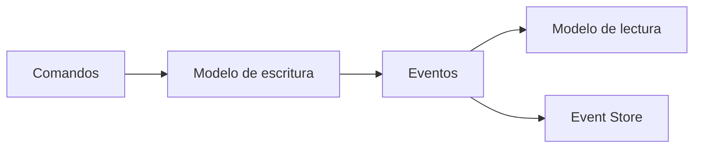

# CQRS + Event Sourcing

## Significado de los términos

- **CQRS** = **C**ommand **Q**uery **R**esponsibility **S**egregation (separación de responsabilidad entre comandos y consultas).
- **Event Sourcing** es un nombre en inglés: “origen en eventos”; la idea es que la fuente de verdad son los eventos, no solo el estado actual.

## Qué es

**CQRS** separa el modelo de **escritura** (comandos que modifican estado) del de **lectura** (consultas sobre modelos optimizados para cada caso de uso). **Event Sourcing** guarda el **historial de eventos** como fuente de verdad: el estado actual se deriva de aplicar esos eventos, y puedes reconstruir cualquier momento pasado o generar vistas de lectura desde el flujo de eventos.

## Para qué sirve

Sirve cuando necesitas **trazabilidad total** (auditoría, compliance, “qué pasó exactamente”) o **modelos de lectura muy especializados** (distintas proyecciones para distintos clientes) sin complicar el modelo de escritura. Event Sourcing permite replay, análisis temporal y nuevas proyecciones sin tocar el pasado.

## Cómo se reconoce y cómo aplicarla

- **En el código:** Por un lado, handlers de comandos que validan, crean eventos y los persisten en un event store; por otro, proyecciones o read models que consumen esos eventos y actualizan vistas (tablas, documentos) para las consultas. En **producción** las lecturas suelen ir contra esas vistas o read models; el event store sigue siendo la fuente de verdad para escritura, *replay* y herramientas de diagnóstico, aunque en algunos diseños también se consulte directamente (p. ej. auditoría).
- **En la práctica:** Un event store (EventStoreDB, Kafka con retención, o diseño propio) y disciplina de versionado de eventos (evolución del esquema sin romper replay). CQRS sin Event Sourcing es posible (solo separar comandos y consultas con modelos distintos); combinados son más potentes pero más complejos.

## Cuándo usarla

- Dominios donde es crucial tener **historial completo de cambios** (auditoría, finanzas, logística).
- Escenarios con muchas lecturas y pocas escrituras, donde quieres **modelos de lectura muy optimizados**.
- Casos con lógica de negocio compleja alrededor de cambios de estado.

## Ventajas

- Trazabilidad total: puedes **reconstruir el estado** en cualquier punto del tiempo.
- Modelos de lectura altamente **especializados** para distintos casos de uso.
- Buena alineación con diseños orientados a eventos.

## Desventajas

- Mayor complejidad conceptual y técnica que una arquitectura tradicional.
- Migraciones y cambios de eventos requieren cuidado (versionado de eventos).
- No es necesaria ni recomendable para la mayoría de aplicaciones CRUD simples.

## Ejemplos / diagramas

## Stacks de ejemplo y laboratorio local

Suele implicar:

- Un **event store** (EventStoreDB, Kafka, bases especializadas o diseño propio).
- Librerías/frameworks que soporten CQRS/ES:
  - Java: Axon Framework.
  - .NET: paquetes y plantillas específicas de CQRS/ES.

Aquí puedes enlazar a ejemplos concretos (por ejemplo, “CQRS/ES con Axon” o “CQRS/ES con .NET”) cuando los tengas documentados.

