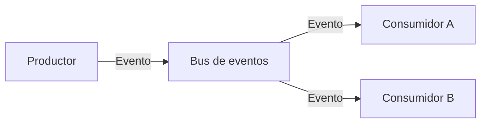

# Arquitectura Event-Driven

## Qué es

Una arquitectura *event-driven* usa **eventos** como medio principal de comunicación: un **productor** emite eventos cuando ocurre algo relevante; uno o varios **consumidores** reaccionan de forma asíncrona. Un **bus o broker** (Kafka, RabbitMQ, etc.) desacopla productores y consumidores en tiempo y en espacio.

## Para qué sirve

Sirve para **desacoplar componentes** que no necesitan responderse al instante: notificaciones, integraciones, réplicas de datos, workflows. Permite **añadir nuevos comportamientos** registrando consumidores sin tocar el productor y escala bien porque el broker absorbe picos y reparte la carga entre consumidores.

## Cómo se reconoce y cómo aplicarla

- **En el código:** Servicios que publican mensajes a un topic o cola (“PedidoCreado”, “UsuarioRegistrado”) y otros que se suscriben y reaccionan. No hay llamadas HTTP directas entre productor y consumidor; la comunicación es asíncrona vía broker.
- **En infraestructura:** Un broker (Kafka, RabbitMQ, SQS/SNS) como pieza central; productores y consumidores pueden estar en distintos repos o equipos. Los eventos suelen ser inmutables y con identificador para idempotencia y replay.
- **En la práctica:** Hay que diseñar bien el contrato de eventos (esquemas, versionado), la idempotencia en consumidores y el tracing para seguir un flujo que cruza varios servicios.

## Cuándo usarla

- Sistemas con muchos **flujos asíncronos** (notificaciones, integraciones, workflows).
- Cuando quieres **desacoplar fuertemente** productores y consumidores.
- Escenarios donde es importante **extender comportamientos** añadiendo nuevos consumidores sin tocar el emisor.

## Ventajas

- Alta **desacoplación temporal y espacial** entre componentes.
- Buena base para **escalabilidad** y extensibilidad.
- Modela bien dominios donde “las cosas pasan” y otros reaccionan.

## Desventajas

- Mayor complejidad en **observabilidad y debugging** (eventos que pasan por múltiples consumidores).
- Gestión de **idempotencia** y reintentos se vuelve crítica.
- Dificulta la trazabilidad de flujos si no se diseña bien el sistema de logging/tracing.

## Ejemplos / diagramas

## Instalación / puesta en marcha

Depende de la tecnología elegida:

- **Brokers de eventos**: Apache Kafka, RabbitMQ, NATS, AWS SNS/SQS, etc.
- **Desarrollo**:
  - Java/Spring: Spring Cloud Stream, Spring Kafka.
  - Node.js: librerías de clientes para Kafka/RabbitMQ, NestJS microservices.

En esta sección puedes registrar tus **stacks preferidos** y comandos básicos para levantar entornos de desarrollo (por ejemplo, `docker-compose` con Kafka + UI de monitoreo).

