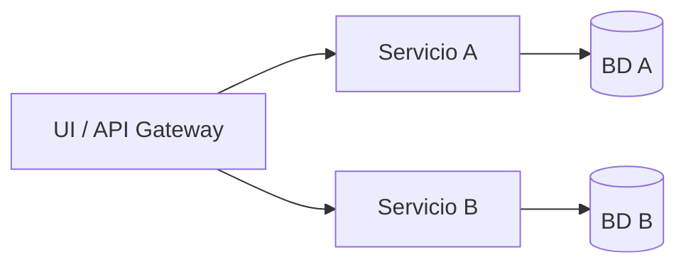

# Arquitectura de Microservicios

## Qué es

La arquitectura de microservicios divide la aplicación en **servicios pequeños e independientes**: cada uno se despliega por separado, suele tener su propia base de datos o esquema y se comunica con otros vía red (HTTP, mensajería, gRPC). Cada servicio representa un **subdominio o capacidad de negocio** con cierta autonomía.

## Para qué sirve

Sirve para **escalar equipos y despliegues por partes**: distintos equipos pueden owning distintos servicios, desplegar en ciclos independientes y escalar solo los servicios que lo necesitan. También permite **variar tecnología** por servicio cuando tiene sentido (por ejemplo, un motor de ML en Python y el resto en .NET).

## Cómo se reconoce y cómo aplicarla

- **En despliegue:** Varios procesos o contenedores (uno o más por servicio); cada uno con su configuración, su BD o esquema y sus dependencias. Suele haber un **API Gateway** (puerta de enlace de API) o **BFF** (*Backend for Frontend*, backend para el frontend) que agrupa las llamadas del cliente hacia los servicios.
- **En el código:** Repositorios separados o módulos muy acotados por servicio; comunicación por HTTP, **gRPC** (*gRPC Remote Procedure Call*, llamadas a procedimientos remotos) o colas (Kafka, RabbitMQ). Cada servicio expone una API y consume las de otros; no se comparte BD entre servicios (o solo por eventos/materializado). *(BD = base de datos; API = Application Programming Interface.)*
- **En la práctica:** Discovery (consul, etcd, Kubernetes), configuración centralizada, trazabilidad distribuida (trace IDs) y manejo de fallos (timeouts, circuit breakers) pasan a ser parte del día a día.

## Cuándo usarla

- Cuando ya tienes un **monolito con problemas claros** de escalado organizativo o técnico.
- Equipos **grandes o múltiples equipos** que necesitan trabajar de forma más independiente.
- Necesitas **escalar partes concretas** del sistema de manera distinta.
- Requieres **distintas tecnologías** para distintos módulos (por ejemplo, un motor de recomendaciones en otro stack).

## Ventajas

- **Despliegue independiente** por servicio (permite ciclos de release diferentes).
- **Escalado fino**: solo escalas los servicios que lo necesitan.
- Mejor alineación con **equipos por dominio** (each service, each team).
- Permite experimentar con **tecnologías diferentes** por servicio si es necesario.

## Desventajas

- Mucha más **complejidad operativa**: orquestación, configuración distribuida, discovery, observabilidad, etc.
- Fallos de red, timeouts y problemas de consistencia eventual se vuelven parte del día a día.
- Debugging más complicado: trazas que cruzan múltiples servicios.
- Riesgo de crear un **“monolito distribuido”** si no se definen bien los límites de cada servicio.

## Ejemplos / diagramas

## Instalación / puesta en marcha

Suele implicar elegir tanto **stack de desarrollo** como **plataforma de despliegue**:

- **Desarrollo**
  - Java/Spring: [Spring Cloud](https://spring.io/projects/spring-cloud) para configuración, discovery, etc.
  - Node.js: NestJS, Express + librerías de mensajería (Kafka, RabbitMQ, etc.).
  - .NET: ASP.NET Core + patrones de API Gateway y servicios independientes.
- **Infraestructura**
  - Contenedores con Docker.
  - Orquestadores como Kubernetes, ECS, etc.
  - Observabilidad: Prometheus, Grafana, OpenTelemetry.
- **Referencias**
  - [microservices.io](https://microservices.io) (patrones de microservicios de Chris Richardson).

En esta sección puedes ir listando las **toolchains concretas** que uses (por ejemplo, “Microservicios con NestJS + Kafka + PostgreSQL en Kubernetes”) y enlazar a markdowns más detallados por stack.

