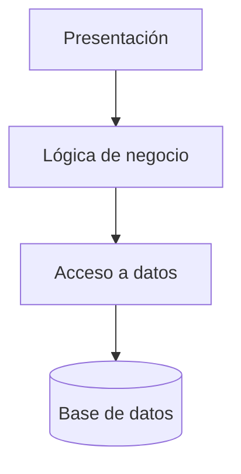

# Arquitectura en N Capas

## Qué es

La arquitectura en N capas (típicamente 3 capas) separa la aplicación en **capas lógicas** con responsabilidades distintas: **presentación** (UI o APIs), **lógica de negocio** (reglas, validaciones, orquestación) y **acceso a datos** (persistencia, ORM, SQL). El flujo suele ir de arriba abajo: la presentación llama a la lógica, y la lógica llama a los datos.

## Para qué sirve

Sirve para **separar responsabilidades** de forma clara y que un cambio en una capa (por ejemplo, cambiar la BD o la tecnología de la UI) no obligue a reescribir todo. Da un modelo mental sencillo a equipos que empiezan y una base para evitar que todo el código se mezcle en un único bloque.

## Cómo se reconoce y cómo aplicarla

- **En el código:** Carpetas o proyectos como `controllers` / `api`, `services` / `application`, `repositories` / `data`. Los controladores no acceden a la BD directamente; delegan en servicios, y los servicios usan repositorios o acceso a datos. Las dependencias van en una dirección (presentación → lógica → datos).
- **En frameworks:** Spring (controller / service / repository), .NET (Web / Application / Infrastructure), NestJS (módulos por capa). La convención del framework suele reflejar estas capas.
- **En la práctica:** Cada capa conoce solo la capa inferior; la capa de datos no conoce la presentación. Si ves que un “repositorio” hace llamadas HTTP o pinta en pantalla, las capas se están mezclando.

## Cuándo usarla

- Aplicaciones de negocio clásicas (CRUD, backoffices, APIs empresariales).
- Equipos que están empezando y necesitan un **modelo mental sencillo**.
- Cuando quieres una **separación mínima** entre interfaz, reglas y datos sin entrar aún en arquitecturas más avanzadas.

## Ventajas

- Estructura **fácil de entender** y muy conocida.
- Buena base para mantener cierta separación de responsabilidades.
- Suele estar bien soportada por frameworks (Spring, .NET, etc.).

## Desventajas

- A veces se convierte en una simple **separación técnica** (controllers/services/repositories) sin límites claros de dominio.
- Si no se cuida, termina en dependencias cruzadas entre capas y módulos.
- Puede ser insuficiente para dominios muy complejos donde se necesita más énfasis en el modelado del dominio.

## Ejemplos / diagramas

## Stacks de ejemplo y laboratorio local

Ejemplos de stack (solo como referencia; **puedes usar otros**):

- **Java / Spring**
  - Capas típicas: `controller` (presentación), `service` (lógica), `repository` (datos).
- **.NET**
  - Proyectos o namespaces separados para `Web`, `Application`, `Infrastructure`.
- **Node.js**
  - Agrupar rutas, servicios y repositorios con una estructura clara de carpetas.

La idea es que aquí registres **cómo estructuras tú** tus proyectos en capas, con ejemplos reales y comandos de creación de proyectos si lo ves útil.

