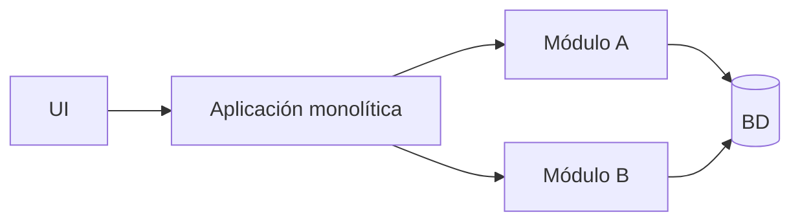

# Monolito Modular

## Qué es

Un monolito modular sigue siendo **un solo despliegue**, pero internamente la aplicación está organizada en **módulos bien delimitados** (por dominio, por contexto, etc.): todo se compila y despliega junto, y cada módulo tiene sus propias capas y depende de otros a través de interfaces claras.

## Para qué sirve

Sirve para **mantener la simplicidad operativa del monolito** (un solo artefacto, un despliegue) pero **evitar el “big ball of mud”**: los módulos acotan responsabilidades y dependencias, lo que facilita mantener el código y, si más adelante lo necesitas, extraer algún módulo a microservicio.

## Cómo se reconoce y cómo aplicarla

- **En el código:** Varias carpetas o proyectos (p. ej. `modulo-usuarios`, `modulo-pedidos`, `modulo-facturacion`), cada una con sus capas internas. Los módulos se usan entre sí vía interfaces o APIs internas, no accediendo directamente a implementaciones ajenas.
- **En despliegue:** Sigue siendo un solo artefacto (un JAR, un proceso, un contenedor); la modularidad es de diseño, no de ejecución.
- **En la práctica:** Convenciones o herramientas (análisis de dependencias, reglas de import) evitan que un módulo dependa de las entrañas de otro; si hay BD compartida, se puede organizar por esquemas o por tablas “por módulo”.

## Cuándo usarla

- Cuando quieres las **ventajas de simplicidad del monolito**, pero evitando el “big ball of mud”.
- Equipos que planean una posible migración futura a microservicios y quieren **preparar los límites** desde ya.
- Productos en crecimiento donde ya detectas varios **subdominios** relativamente independientes.

## Ventajas

- Mantienes un **solo artefacto de despliegue**, pero con organización interna más sana.
- Facilita **extraer microservicios** en el futuro si los módulos están bien aislados.
- Mejor mantenibilidad que un monolito completamente mezclado.

## Desventajas

- Requiere disciplina del equipo para respetar los límites de módulos.
- Si los módulos no están bien pensados, puede quedarse en una **agrupación de carpetas** sin verdadero aislamiento.
- Puede dar una falsa sensación de modularidad si no se restringen las dependencias entre módulos.

## Ejemplos / diagramas

## Stacks de ejemplo y laboratorio local

Ejemplos de stack (solo como referencia; **puedes usar otros**):

- Partir de un **monolito tradicional** (Spring, NestJS, .NET, etc.) y organizar el código en módulos por dominio:
  - `usuarios`, `pedidos`, `facturacion`, etc.
  - Cada módulo con sus propias capas internas.
- Definir reglas de dependencia (por ejemplo, mediante herramientas de análisis estático o convenciones de paquetes) para evitar referencias cruzadas indebidas.

La idea es que esta sección recoja **cómo tú organizas realmente tus monolitos modulares** en tus proyectos.

