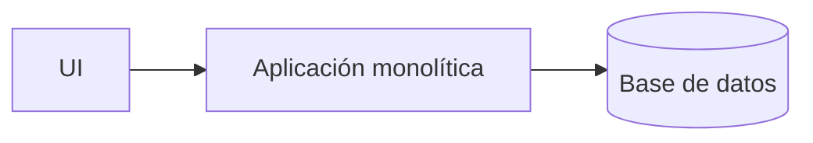

# Arquitectura Monolítica

## Qué es

Una arquitectura monolítica es aquella en la que **toda la aplicación** (módulos de negocio, APIs, vistas, acceso a datos, etc.) se despliega como **una única unidad ejecutable**:

- Un solo proceso (o muy pocos).
- Suele tener **una sola base de datos principal**.
- Los módulos se comunican por llamadas internas, no por red.

## Para qué sirve

Sirve para **lanzar un producto o un sistema interno con el mínimo de complejidad operativa**: un solo artefacto para desplegar, un solo proceso que depurar y una base de datos que administrar. Permite iterar rápido al principio sin invertir en infraestructura distribuida.

## Cómo se reconoce y cómo aplicarla

- **En el código:** Un único repositorio (o muy pocos) con toda la lógica: controladores, servicios, repositorios, entidades. Las “capas” suelen ser carpetas o namespaces dentro del mismo proyecto.
- **En despliegue:** Un solo ejecutable o contenedor (un JAR, un proceso Node, una app .NET) que levanta la API o la web y se conecta a una BD.
- **En runtime:** Una sola aplicación atendiendo peticiones; si necesitas más capacidad, duplicas la misma aplicación detrás de un balanceador (escalado horizontal del monolito completo).

## Cuándo usarla

- Proyectos **nuevos** donde todavía no conoces bien el dominio ni el patrón de tráfico.
- Equipos **pequeños o medianos** donde la coordinación es sencilla.
- Aplicaciones internas o de negocio con **alcance acotado**.
- Cuando quieres **ir rápido al principio** y evitar complejidad de distribución, orquestación, observabilidad, etc.

## Ventajas

- **Simplicidad operacional**: un solo artefacto para desplegar.
- **Menos sobrecoste técnico**: no necesitas orquestadores, discovery, tracing distribuido, etc.
- **Depuración más sencilla**: todo ocurre en un único proceso; es fácil reproducir errores en local.
- **Refactors globales más directos**: puedes cambiar interfaces internas sin contratos de red entre servicios.

## Desventajas

- **Escalado menos flexible**: escalas toda la app aunque el cuello de botella esté en un solo módulo.
- **Acoplamiento fuerte**: es fácil que los módulos se mezclen si no cuidas las dependencias internas.
- **Deploys más arriesgados**: un cambio defectuoso puede tumbar toda la aplicación.
- Con el tiempo puede evolucionar a un **“big ball of mud”** si no se aplican buenas prácticas de diseño.

## Ejemplos / diagramas

## Instalación / puesta en marcha

Depende de la tecnología, pero típicamente:

- **Java / Spring Boot**
  - Crear un proyecto monolítico con Spring Initializr (`spring.io`), empaquetar como `jar` o `war`.
  - Referencia: [Guía oficial de Spring Boot - Building an Application](https://spring.io/guides/gs/spring-boot/).
- **Node.js / NestJS, Express**
  - Un único proyecto Node con todas las capas (rutas, servicios, repositorios).
  - Referencia: [Docs de NestJS - First Steps](https://docs.nestjs.com/first-steps).
- **.NET**
  - Solución con un solo proyecto (Web API o MVC) que contiene la lógica principal.
  - Referencia: [Tutoriales de ASP.NET Core](https://learn.microsoft.com/aspnet/core).

En tu biblioteca puedes ir añadiendo **plantillas de proyectos** que realmente uses (por ejemplo, un `monolito-nestjs.md` separado si quieres bajar a detalle).

