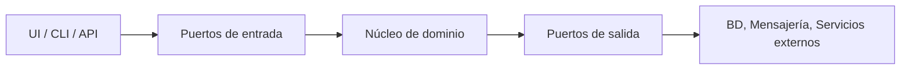

# Arquitectura Hexagonal

## Qué es

La arquitectura hexagonal (también **Ports and Adapters**, “puertos y adaptadores”) pone el **núcleo de dominio en el centro** y a su alrededor define **puertos** (interfaces de entrada y salida) y **adaptadores** (implementaciones que conectan con el mundo exterior: API REST, CLI, BD, colas, etc.). El dominio no conoce detalles técnicos; solo trabaja con interfaces. *(REST = Representational State Transfer; BD = base de datos.)*

## Para qué sirve

Sirve para **aislar las reglas de negocio** de la tecnología: puedes cambiar la BD, el framework web o añadir una CLI sin tocar el dominio. Facilita **tests** (mockeando puertos de salida) y **múltiples formas de entrada** (REST, eventos, batch) sobre el mismo núcleo.

## Cómo se reconoce y cómo aplicarla

- **En el código:** Carpetas o paquetes como `domain` (entidades, reglas puras), `application` o `ports` (interfaces “recibir comando”, “obtener dato”), `adapters` (implementaciones: `RestAdapter`, `PostgresAdapter`, `KafkaAdapter`). El dominio no importa nada de infraestructura; los adaptadores implementan interfaces definidas en el dominio o en una capa de aplicación.
- **Flujo:** Una petición llega por un adaptador de entrada (p. ej. controller REST), que traduce a un caso de uso o comando del dominio; el dominio (o aplicación) usa puertos de salida (p. ej. “guardar pedido”) que un adaptador implementa contra la BD real.
- **En la práctica:** Si el “dominio” tiene referencias a `HttpContext`, SQL o Kafka, la hexágono se está rompiendo; esas referencias deben estar solo en adaptadores.

## Cuándo usarla

- Dominios **complejos** donde quieres aislar bien reglas de negocio de detalles de infraestructura.
- Sistemas que necesitan **múltiples interfaces** de entrada/salida (REST, eventos, CLI, batch, etc.).
- Proyectos donde prevés que cambiarás tecnologías: base de datos, proveedor de mensajes, framework web…
- Cuando quieres **tests de dominio rápidos y estables**, sin depender de infraestructura real.

## Ventajas

- **Aislamiento del dominio**: las reglas de negocio viven en un núcleo limpio.
- **Sustituibilidad de infraestructura**: puedes cambiar un adaptador (por ejemplo, de PostgreSQL a Mongo) sin tocar el dominio.
- **Mejor testabilidad**: puedes mockear puertos de salida y probar el dominio en memoria.
- Favorece un diseño más **explícito y modular**.

## Desventajas

- Mayor **complejidad inicial**: más capas, más interfaces, más archivos.
- Si el dominio es sencillo, puede sentirse como **sobre-ingeniería**.
- Requiere disciplina del equipo para respetar las **dependencias hacia dentro** (infra → dominio, no al revés).

## Ejemplos / diagramas

## Instalación / puesta en marcha

No existe una “instalación” estándar porque es un **estilo de organización**, pero hay guías por tecnología:

- **Artículo original de Alistair Cockburn**  
  Referencia: [“Hexagonal Architecture”](https://alistair.cockburn.us/hexagonal-architecture/).
- **Ejemplos en Java / Spring**  
  - Patrones de capas `domain`, `application`, `infrastructure`, `adapters`.  
  - Referencia: [Guías de arquitectura hexagonal con Spring Boot (Baeldung, Reflectoring, etc.)].
- **Ejemplos en Node.js / NestJS**  
  - Crear módulos `domain`, `application` y `infrastructure`, inyectando adaptadores a través de interfaces.  
  - Referencia: [NestJS - Modules & Providers](https://docs.nestjs.com/modules).

Puedes documentar aquí **tu plantilla preferida** (por ejemplo, árbol de carpetas y convenciones de nombres que vayas adoptando en tus proyectos).

