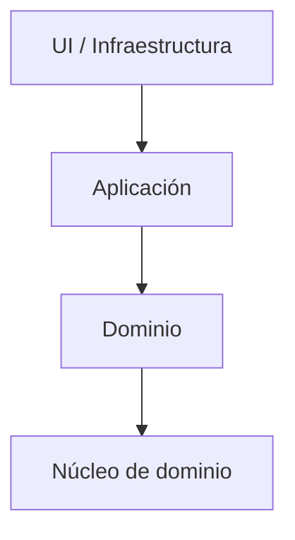

# Arquitectura Onion

## Qué es

La arquitectura Onion organiza el sistema en **capas en forma de cebolla**: núcleo de dominio en el centro, servicios de aplicación en capas intermedias, infraestructura y frameworks en la externa. Las dependencias solo van **de fuera hacia dentro**; el dominio no conoce la infraestructura.

## Para qué sirve

Sirve para **proteger el dominio** y permitir cambiar infraestructura (BD, UI, APIs) sin tocar el núcleo. Comparte objetivos con Clean Architecture y hexagonal; la diferencia es sobre todo terminológica (anillos vs capas vs puertos). Muy alineada con **DDD** (*Domain-Driven Design*, diseño guiado por el dominio) y tests de dominio rápidos. *(BD = base de datos; UI = interfaz de usuario; API = Application Programming Interface.)*

## Cómo se reconoce y cómo aplicarla

- **En el código:** Estructura por proyectos o capas: `Domain` (entidades, valor objects), `Application` o `DomainServices`, `Infrastructure` (persistencia, mensajería), `Web` o `API`. Cada capa solo referencia la capa más interna que necesita; el dominio no tiene referencias a capas externas.
- **En la práctica:** Si tu equipo ya usa Clean o hexagonal, Onion añade la misma idea con otro nombre; no hace falta aplicar “las tres”. Elige una y mantén convenciones consistentes (inyección de dependencias hacia dentro, interfaces en el núcleo).

## Cuándo usarla

- Dominios donde quieres enfatizar mucho la **separación entre dominio e infraestructura**.
- Proyectos con necesidad de **tests de dominio muy rápidos y fiables**.
- Cuando te sientes cómodo pensando en términos de “anillos” de responsabilidad.

## Ventajas

- Aísla claramente el **núcleo de dominio**.
- Facilita cambiar infraestructura sin tocar reglas de negocio.
- Buena alineación con prácticas de DDD.

## Desventajas

- Muy parecida a Clean/Hexagonal; usar las tres nociones a la vez puede generar confusión en el equipo.
- Más adecuada para dominios de cierta complejidad; puede resultar pesada para aplicaciones sencillas.

## Ejemplos / diagramas

## Instalación / puesta en marcha

Suele implementarse mediante **proyectos/módulos separados por capa**:

- En .NET: proyectos `Domain`, `Application`, `Infrastructure`, `Web`.
- En Java: módulos Gradle/Maven por capa.

Puedes enlazar desde aquí a ejemplos concretos en tu stack (por ejemplo, “Onion con .NET” o “Onion con Spring”), cuando los vayas documentando en otros markdowns.

