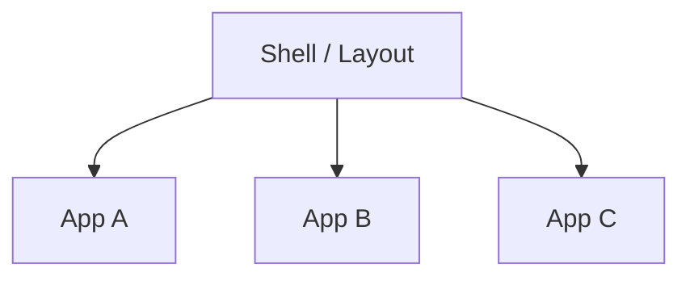

# Micro-frontends

## Qué es

Los micro-frontends aplican la idea de microservicios al **frontend**: una interfaz grande se compone de **aplicaciones front pequeñas e independientes** (micro-frontends) integradas en un **shell** común (layout, navegación, contenedor). Cada micro-frontend puede tener su propio repo, stack y ciclo de despliegue.

## Para qué sirve

Sirve cuando **varios equipos** deben owning partes distintas de la misma UI y quieren desplegar sin coordinarse en un único release. Permite **evolucionar tecnología por zona** (por ejemplo, migrar un módulo a un framework nuevo) y escalar la organización sin que una sola codebase front se vuelva ingobernable.

## Cómo se reconoce y cómo aplicarla

- **En el código:** Un shell (host) que carga “aplicaciones” remotas (otras builds) por ruta o por zona de la pantalla; cada aplicación es un frontend completo (React, Vue, etc.) construido y desplegado por separado. Técnicas típicas: Module Federation (Webpack), single-spa, iframes, Web Components.
- **En la práctica:** Hay que definir contrato entre shell y micro-frontends (rutas, props, eventos), diseño compartido (tokens, componentes base) y estrategia de dependencias (compartir React o no, versiones) para evitar duplicar y romper consistencia visual.

## Cuándo usarla

- Organizaciones con **equipos front grandes** que necesitan autonomía.
- Aplicaciones muy grandes donde una sola codebase de frontend se vuelve inmanejable.
- Cuando varias partes de la UI tienen **ciclos de release distintos**.

## Ventajas

- Autonomía de equipos y ciclos de despliegue por aplicación.
- Posibilidad de **evolucionar tecnología por zonas** (por ejemplo, migrar una sección a un nuevo framework).
- Mejor escalabilidad organizativa para frontends grandes.

## Desventajas

- Mayor complejidad en **integración, routing, diseño visual consistente**.
- Riesgo de duplicar lógica o dependencias si no se definen bien las fronteras.
- Requiere un buen diseño de *shell* y contrato entre micro-frontends.

## Ejemplos / diagramas

## Stacks de ejemplo y laboratorio local

En la práctica se usan varias técnicas:

- **Module Federation (Webpack)** para cargar aplicaciones remotas.
- Frameworks específicos de micro-frontends (por ejemplo, single-spa).
- Integración basada en iframes o Web Components (con sus pros y contras).

Aquí puedes documentar enfoques concretos que pruebes (por ejemplo, “micro-frontends con Module Federation + React”) y enlazar a sus repos o tutoriales.

