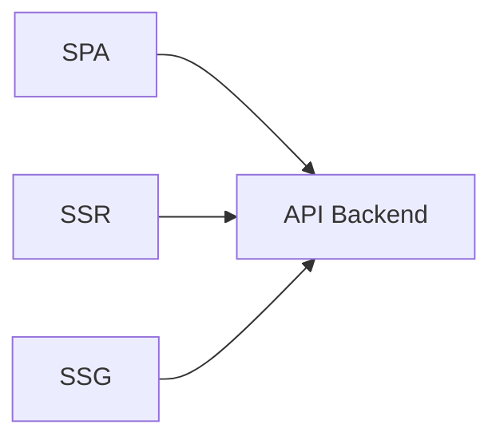

# SPA vs SSR vs SSG

## Significado de los términos

- **SPA** = **S**ingle **P**age **A**pplication (aplicación de una sola página).
- **SSR** = **S**erver **S**ide **R**endering (renderizado en el servidor).
- **SSG** = **S**tatic **S**ite **G**eneration (generación de sitio estático).
- **API** = *Application Programming Interface* (interfaz de programación de aplicaciones).
- **SEO** = *Search Engine Optimization* (optimización para motores de búsqueda).
- **CDN** = *Content Delivery Network* (red de entrega de contenido).

## Qué es

Tres formas de **entregar y renderizar** el frontend web:

- **SPA (Single Page Application):** Una sola página HTML; el contenido se genera en el **navegador** con JavaScript (React, Vue, Angular). El servidor devuelve datos vía API y el cliente pinta la UI.
- **SSR (Server Side Rendering):** El **servidor** genera el HTML en cada petición (Next.js, Nuxt, PHP, etc.). El cliente recibe HTML listo y puede hidratar para interactividad.
- **SSG (Static Site Generation):** Las páginas se **generan en build** y se sirven como archivos estáticos (Next.js estático, Astro, Gatsby). No hay render en cada request.

## Para qué sirve cada una

- **SPA:** Aplicaciones muy interactivas, experiencia tipo app; el trade-off es primera carga y SEO más trabajosos.
- **SSR:** Buen **SEO** y primera carga rápida con contenido dinámico por request (personalización, datos en tiempo real).
- **SSG:** **Rendimiento y coste**: contenido estático muy rápido y barato de servir (CDN); ideal para docs, blogs, landing.

## Cómo se reconoce y cómo aplicarla

- **SPA:** Un `index.html` mínimo y un bundle JS que monta la app; las rutas y el contenido se resuelven en el cliente; las llamadas son a una API REST o GraphQL.
- **SSR:** El framework tiene un servidor que, por cada ruta, ejecuta código (React, Vue, etc.) en el servidor y devuelve HTML; luego el cliente “hidrata” para que los eventos funcionen.
- **SSG:** En build se recorren rutas o fuentes de datos y se generan archivos HTML (y assets); en producción solo se sirven archivos estáticos. Next.js y Astro permiten mezclar SSG, SSR y SPA por ruta.

## Cuándo usar cada una

- **SPA**
  - Apps muy interactivas y ricas en UI.
  - Interfaces que se comportan casi como aplicaciones de escritorio.
- **SSR**
  - Necesidad fuerte de **SEO** y tiempo de primera carga rápido.
  - Contenido que cambia con frecuencia y depende del usuario.
- **SSG**
  - Sitios con contenido mayormente estático: blogs, documentación.
  - Cuando quieres rendimiento muy alto y coste bajo en servidor.

## Ventajas / desventajas por enfoque

- **SPA**
  - Ventajas: gran experiencia de usuario, navegación fluida.
  - Desventajas: SEO más complicado, *bundle* JS más pesado.
- **SSR**
  - Ventajas: mejor SEO y *Time To First Byte*; contenido dinámico.
  - Desventajas: más carga en el servidor, arquitectura algo más compleja.
- **SSG**
  - Ventajas: súper rápido, fácil de cachear/CDN, barato de servir.
  - Desventajas: peor para contenido que cambia constantemente o muy personalizado.

## Ejemplos / diagramas

Muchas apps **SPA** y **SSR** consumen una API en cada vista; en **SSG** el HTML se genera en *build* y a veces no hace falta API en tiempo de lectura (solo para datos dinámicos en el cliente o rutas híbridas).

## Stacks de ejemplo y laboratorio local

Ejemplos típicos:

- **Next.js**
  - Soporta SPA, SSR y SSG en un mismo framework.
  - Referencia: [Documentación de Next.js](https://nextjs.org/docs).
- **Astro**
  - Enfocado en SSG/islas de interactividad.
  - Referencia: [Documentación de Astro](https://docs.astro.build).

En esta sección puedes ir añadiendo **plantillas de proyectos front** (Next, Astro, Vite, etc.) con los comandos básicos (`npx create-next-app`, `npm create astro@latest`, etc.).

