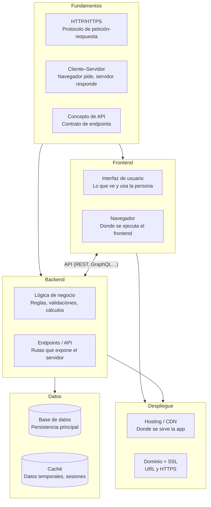
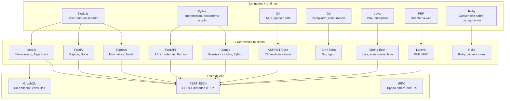
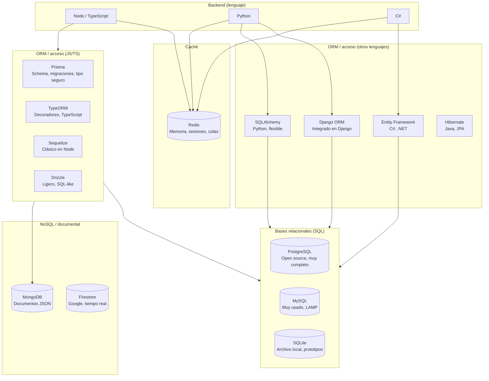
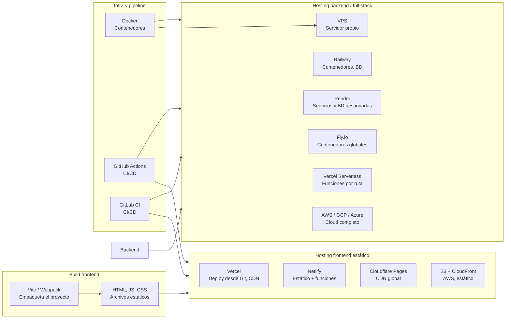
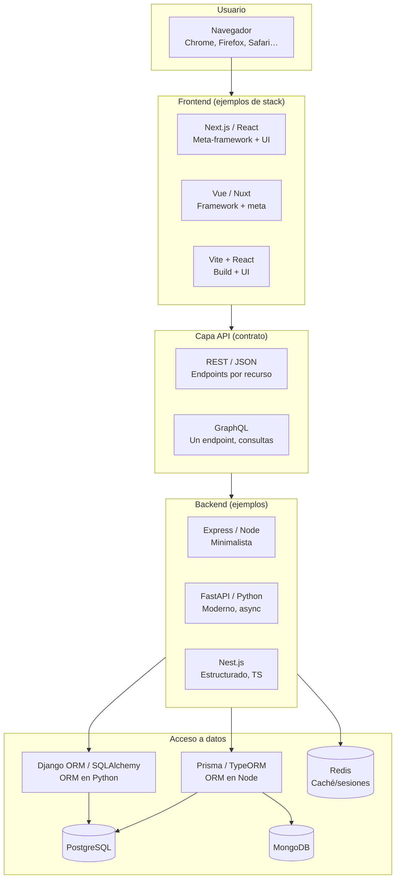

# Crear una aplicación web — Diagramas y stacks

Estos diagramas muestran las **relaciones entre las áreas** de una aplicación web y detallan **herramientas, frameworks y librerías** típicos en cada capa. Cada uno va acompañado de una **descripción de los elementos** para entender qué es cada cosa. Están hechos en Mermaid y se renderizan automáticamente en este sitio.

---

## 1. Flujo y relación entre áreas

El diagrama resume el flujo de una app web: qué bloques existen y cómo se conectan (fundamentos como base, frontend y backend comunicados por API, backend como único que accede a datos, despliegue uniendo todo).



### Descripción de los elementos (diagrama 1)

| Bloque / elemento | Qué es |
|-------------------|--------|
| **Fundamentos** | Conocimientos base sin los cuales no se entiende el resto. |
| **HTTP / HTTPS** | Protocolo con el que el navegador y el servidor se hablan: método (GET, POST…), cabeceras, cuerpo, códigos de estado. HTTPS añade cifrado. |
| **Cliente–Servidor** | Modelo en el que el **cliente** (navegador) pide recursos y el **servidor** responde con HTML, JSON, etc. |
| **Concepto de API** | Interfaz que expone el backend: URLs + métodos + formato de datos (p. ej. REST con JSON). |
| **Frontend** | Parte de la aplicación que corre en el navegador: pantallas, formularios, llamadas al backend. |
| **Interfaz de usuario (UI)** | Lo que la persona ve y con lo que interactúa (botones, listas, formularios). |
| **Navegador** | Entorno donde se ejecuta el JavaScript y se pinta el HTML/CSS del frontend. |
| **Backend** | Servidor que contiene la lógica de negocio, expone la API y habla con la base de datos. |
| **Lógica de negocio** | Reglas del dominio: validaciones, cálculos, autorizaciones, orquestación. |
| **Endpoints / API** | Rutas que el backend expone (p. ej. `GET /api/usuarios`) para que el frontend las consuma. |
| **Base de datos** | Donde se guardan los datos de forma persistente (tablas, documentos, etc.). |
| **Caché** | Almacén temporal (p. ej. Redis) para sesiones, respuestas repetidas o rate limiting. |
| **Despliegue** | Paso a producción: dónde se aloja la app y cómo se expone (dominio, SSL). |
| **Hosting / CDN** | Servidor o red de entrega de contenido que sirve el frontend estático y/o el backend. |
| **Dominio + SSL** | URL pública de la app y certificado para HTTPS. |

---

## 2. Frontend — Herramientas y relaciones

Detalle de **librerías, frameworks y herramientas** en frontend: base, frameworks de UI, meta-frameworks, estilos, estado/datos en cliente y herramientas de build.

```mermaid
flowchart LR
  subgraph BASE[" Base (lenguajes y estándares) "]
    HTML["HTML5<br/>Estructura de la página"]
    CSS["CSS3<br/>Estilos y maquetación"]
    JS["JS/TypeScript<br/>Lógica e interactividad"]
  end

  subgraph UI[" Frameworks / librerías de UI "]
    React["React<br/>Componentes, virtual DOM"]
    Vue["Vue<br/>Reactividad, templates"]
    Svelte["Svelte<br/>Compilador, sin runtime pesado"]
    Angular["Angular<br/>Framework completo"]
    Solid["Solid.js<br/>Reactivo por señales"]
  end

  subgraph META[" Meta-frameworks "]
    Next["Next.js<br/>React + SSR/SSG + rutas"]
    Nuxt["Nuxt<br/>Vue + SSR/SSG + rutas"]
    SvelteKit["SvelteKit<br/>Svelte + SSR + rutas"]
    Remix["Remix<br/>React + rutas + datos"]
  end

  subgraph ESTILOS[" Estilos (herramientas) "]
    Tailwind["Tailwind<br/>Clases utilitarias"]
    Sass["Sass<br/>CSS con variables y anidación"]
    CSSModules["CSS Modules<br/>CSS por componente"]
    Styled["styled-components<br/>CSS-in-JS"]
  end

  subgraph ESTADO_DATOS[" Estado y datos en cliente "]
    ReactQuery["React Query<br/>Caché y sincronización de API"]
    SWR["SWR<br/>Fetch con caché (Vercel)"]
    Pinia["Pinia/Vuex<br/>Estado global (Vue)"]
    Zustand["Zustand<br/>Estado global (React)"]
  end

  subgraph BUILD[" Build y paquetes "]
    Vite["Vite<br/>Build rápido, ESM"]
    Webpack["Webpack<br/>Bundler clásico"]
    npm["npm/pnpm/yarn<br/>Gestión de dependencias"]
  end

  BASE --> UI
  UI --> META
  BASE --> ESTILOS
  UI --> ESTADO_DATOS
  UI --> BUILD
  META --> BUILD
```



### Descripción de los elementos (diagrama 2 — Frontend)

| Elemento | Qué es |
|----------|--------|
| **HTML5** | Lenguaje de marcado que define la estructura de la página (encabezados, listas, formularios, semántica). |
| **CSS3** | Hojas de estilo para diseño visual, maquetación (Flex, Grid), responsividad y temas. |
| **JavaScript / TypeScript** | JS es el lenguaje de programación del navegador; TypeScript añade tipos estáticos. |
| **React** | Librería de UI basada en componentes y un “DOM virtual” para actualizar solo lo que cambia. |
| **Vue** | Framework progresivo: reactividad integrada, templates en HTML, ecosistema oficial (Vue Router, Pinia). |
| **Svelte** | Enfoque compilador: genera JavaScript que actualiza el DOM directamente, sin virtual DOM pesado. |
| **Angular** | Framework completo (Google): routing, formularios, HTTP, inyección de dependencias, TypeScript por defecto. |
| **Solid.js** | Sintaxis tipo React pero con reactividad por señales; muy buen rendimiento. |
| **Next.js** | Meta-framework sobre React: SSR, SSG, rutas basadas en archivos, API routes. |
| **Nuxt** | Meta-framework sobre Vue: SSR, SSG, rutas, módulos. |
| **SvelteKit** | Meta-framework sobre Svelte: SSR, rutas, adaptadores de despliegue. |
| **Remix** | Framework sobre React centrado en rutas, carga de datos y mutaciones. |
| **Tailwind CSS** | Utilidades CSS (clases) para maquetar sin escribir CSS a mano; muy usado con React/Vue. |
| **Sass** | Preprocesador CSS: variables, anidación, mixins; se compila a CSS. |
| **CSS Modules** | Archivos CSS con alcance local por componente (evitan conflictos de nombres). |
| **styled-components** | Librería CSS-in-JS: escribes estilos en JavaScript, se generan clases únicas. |
| **React Query (TanStack Query)** | Gestiona peticiones al backend: caché, revalidación, estados de carga/error. |
| **SWR** | Hook de React para “fetch con caché” y revalidación; ligero. |
| **Pinia / Vuex** | Pinia es el store oficial de Vue para estado global; Vuex es la versión anterior. |
| **Zustand** | Librería mínima de estado global para React, sin boilerplate. |
| **Vite** | Herramienta de build que usa ESM nativo en desarrollo y Rollup para producción; muy rápida. |
| **Webpack** | Bundler que empaqueta módulos (JS, CSS, assets) en uno o varios archivos para el navegador. |
| **npm / pnpm / yarn** | Gestores de paquetes: instalan dependencias y ejecutan scripts (build, test, etc.). |

---

## 3. Backend — Lenguajes, frameworks y tipos de API

Lenguajes y runtimes, frameworks backend que se usan con cada uno, y estilos de API que suelen exponer (REST, GraphQL, tRPC).



### Descripción de los elementos (diagrama 3 — Backend)

| Elemento | Qué es |
|----------|--------|
| **Node.js** | Runtime de JavaScript en el servidor; permite usar el mismo lenguaje en frontend y backend. |
| **Python** | Lenguaje interpretado con muchas librerías para web, datos y automatización. |
| **C#** | Lenguaje de Microsoft, tipado fuerte; se usa con .NET para APIs y servicios. |
| **Go** | Lenguaje compilado de Google; bueno para servicios de alto rendimiento y concurrencia. |
| **Java** | Lenguaje que corre en la JVM; muy usado en entornos empresariales. |
| **PHP** | Lenguaje pensado para web; corre en la mayoría de hostings compartidos. |
| **Ruby** | Lenguaje orientado a la expresión y a la convención; muy usado con Rails. |
| **Express** | Framework mínimo para Node: rutas, middlewares, sin opinión fuerte sobre estructura. |
| **Fastify** | Framework para Node centrado en rendimiento y esquemas de validación. |
| **Nest.js** | Framework para Node/TypeScript con inyección de dependencias, módulos y estilo tipo Angular. |
| **Django** | Framework completo en Python: ORM, admin, auth, formularios; “baterías incluidas”. |
| **FastAPI** | Framework en Python para APIs modernas: tipado, documentación automática (OpenAPI), async. |
| **ASP.NET Core** | Framework de Microsoft para APIs y web en C#; multiplataforma, alto rendimiento. |
| **Spring Boot** | Framework en Java que simplifica la configuración de Spring; estándar en muchos equipos Java. |
| **Laravel** | Framework PHP con MVC, Eloquent (ORM), colas, autenticación. |
| **Rails** | Framework Ruby con convenciones fuertes, ActiveRecord (ORM), mucho hecho por defecto. |
| **Gin / Echo** | Frameworks ligeros para Go; ideales para APIs REST. |
| **REST JSON** | Estilo de API: recursos como URLs, métodos HTTP (GET, POST, PUT, DELETE), cuerpo en JSON. |
| **GraphQL** | Lenguaje de consulta: un endpoint, el cliente pide exactamente los campos que necesita. |
| **tRPC** | API tipo RPC con tipado end-to-end en TypeScript; sin código generado, sin OpenAPI. |

---

## 4. Datos — Bases de datos, ORMs y acceso

Bases de datos (relacionales, documentales, caché), ORMs y clientes que usa el backend para acceder a ellas, y relación con cada lenguaje.



### Descripción de los elementos (diagrama 4 — Datos)

| Elemento | Qué es |
|----------|--------|
| **PostgreSQL** | Base de datos relacional open source; muy completa (JSON, full-text, extensiones). |
| **MySQL** | Base relacional muy usada en hosting compartido y stacks LAMP. |
| **SQLite** | BD en un solo archivo; ideal para desarrollo, prototipos o apps embebidas. |
| **MongoDB** | Base de datos documental: guarda documentos (p. ej. JSON); esquema flexible. |
| **Firestore** | Base de datos en la nube (Google); sincronización en tiempo real y escalado automático. |
| **Redis** | Almacén en memoria: caché, sesiones, colas, rate limiting; muy rápido. |
| **Prisma** | ORM para Node/TypeScript: schema en un archivo, migraciones, cliente tipado. |
| **TypeORM** | ORM para Node/TypeScript con decoradores; estilo similar a Hibernate. |
| **Sequelize** | ORM clásico para Node; soporta varias bases relacionales. |
| **Drizzle** | ORM ligero para TypeScript; consultas cercanas a SQL. |
| **Django ORM** | ORM integrado en Django (Python); modelos, migraciones, admin. |
| **SQLAlchemy** | ORM y toolkit SQL para Python; muy flexible, usado con FastAPI. |
| **Entity Framework** | ORM de Microsoft para C#/.NET; Code First, migraciones, LINQ. |
| **Hibernate** | ORM estándar en Java (JPA); mapeo objeto-relacional. |

---

## 5. Despliegue — Hosting y pipeline

Build del frontend, opciones de hosting para frontend estático y para backend, y herramientas de infra (contenedores, CI/CD).



### Descripción de los elementos (diagrama 5 — Despliegue)

| Elemento | Qué es |
|----------|--------|
| **Vite / Webpack (build)** | Herramientas que compilan el proyecto frontend (TS, JSX, CSS) en archivos listos para producción. |
| **Archivos estáticos** | HTML, JS y CSS resultantes del build; se sirven tal cual desde un servidor o CDN. |
| **Vercel** | Plataforma de despliegue: conectas el repo, hace build y despliega; soporta Next.js, funciones serverless y CDN. |
| **Netlify** | Similar a Vercel: estático desde Git, funciones serverless, formularios, split testing. |
| **Cloudflare Pages** | Hosting estático en la red de Cloudflare; deploy desde Git, sin coste para proyectos pequeños. |
| **S3 + CloudFront** | En AWS: S3 guarda los archivos estáticos; CloudFront es la CDN que los sirve. |
| **Vercel Serverless** | En Vercel, cada ruta de API o página dinámica puede ser una función que se ejecuta bajo demanda. |
| **Railway** | Plataforma que despliega contenedores y ofrece BD y Redis; muy simple para proyectos pequeños. |
| **Render** | Servicios web y workers; BD PostgreSQL gestionada; despliegue desde Git. |
| **Fly.io** | Despliega contenedores cerca del usuario (múltiples regiones); buena opción para APIs globales. |
| **VPS** | Servidor virtual (DigitalOcean, Linode, etc.): tienes control total, tú instalas y mantienes todo. |
| **AWS / GCP / Azure** | Proveedores de cloud: máquinas, bases de datos, colas, almacenamiento, etc. |
| **Docker** | Contenedores: empaquetas la app y sus dependencias en una imagen que corre igual en cualquier sitio. |
| **GitHub Actions** | Automatización en GitHub: al hacer push puedes ejecutar tests, build y desplegar. |
| **GitLab CI** | Pipeline de integración y despliegue en GitLab; definido en un archivo en el repo. |

---

## 6. Vista integrada — De frontend a datos

Un único diagrama que recorre **navegador → frontend → API → backend → ORM/BD** con ejemplos concretos de tecnologías.



### Descripción de los elementos (diagrama 6 — Vista integrada)

| Elemento | Qué representa en el flujo |
|----------|----------------------------|
| **Navegador** | Donde el usuario abre la app; ejecuta el JavaScript del frontend y hace peticiones al backend. |
| **Next.js / React, Vue / Nuxt, Vite + React** | Tres formas típicas de montar el frontend: meta-framework (Next/Nuxt) o build (Vite) + librería de UI. |
| **REST / JSON, GraphQL** | Cómo el frontend y el backend se comunican: URLs + métodos + JSON, o un endpoint GraphQL con consultas. |
| **Express, FastAPI, Nest.js** | Ejemplos de servidor backend que implementan la API y llaman a la base de datos. |
| **Prisma / TypeORM, Django ORM / SQLAlchemy** | Capa que traduce entre el código (objetos) y la base de datos (tablas/documentos). |
| **PostgreSQL, MongoDB, Redis** | Persistencia principal (relacional o documental) y caché; el backend es el único que se conecta a ellos. |

---

## Cómo usar estos diagramas

- **En este sitio:** los bloques ` ```mermaid ` se renderizan como diagramas gracias al tema Mermaid de Docusaurus.
- **En otros sitios:** puedes copiar el código Mermaid a [Mermaid Live Editor](https://mermaid.live) o a cualquier herramienta que soporte Mermaid (Notion, GitHub, GitLab, etc.).
- **Para ampliar:** puedes duplicar un diagrama en este mismo archivo y añadir más nodos o subgrafos siguiendo la misma sintaxis.

Este documento se relaciona con [SPA, SSR, SSG](/docs/arquitecturas-desarrollo-software/web-cliente/spa-ssr-ssg), [Bases de datos](/docs/bases-datos/fundamentos) y [Arquitecturas](/docs/arquitecturas-desarrollo-software/monoliticas/monolito).
